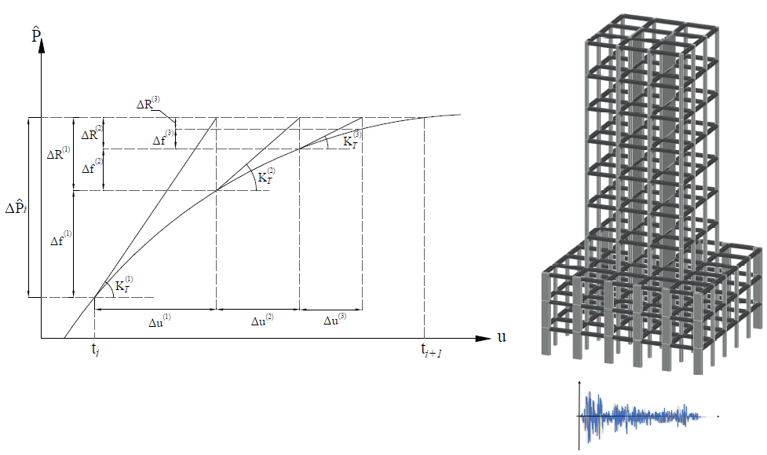

# NLDYNA - Nonlinear Dynamic Analysis.

## Julian Parra.

## This document corresponds to the project required as a partial fullfilment of the requirements for the Master of Engineering degree at Universidad EAFIT.

## Introduction

The study of structural systems considering inelastic response was, until very recently, only possible through the use of commercial packages with subsequent limitations as research tools. Commercial packages are very rigid since not all of them allow the addition of independent elements and/or material models as often required in research activities. At the same time the used solvers in commercial codes are of the black-box type making its extension to general tasks an impossible goal. The recent development of high level lenguages (e.g., Python) facilitates the development of highly efficient in-house implementations. This project describes a general in-house finite element assembler and solver aimed at studying the non-linear response of dynamic systems. The code is intended to be used in the testing of material models, complex kinematic formulations and novel structural systems commonly required in research activities. The code has the following features:

* **It is multiphysics oriented:** The code is a general dynamic Newton-Raphson solver where the physical context is provided by the user in terms of material and/or element models.

* **The implementation has been fully parametrized:** It does not have an implicit space dimensionality and problems with an arbitrary number of degrees of freedom per node can be solved.

* **Python based user elements and material models:** The implementation of user elements and user constitutive models is highly simplified in comparisson with commercial codes as it is conducted in a high level language.

* **Easily coupled with independent scripts:** Since the code is fully open and written in a modular structure it can be coupled with external independent scripts required in specific analysis and design problems.

## Nonlinear dynamic analysis of generalized finite element problems.
**NLDYNA** is a generalized finite element program for the solution of time-dependent non-linear problems. The code is able to handle static and dynamic analysis problems assumed of hyperbolic nature. It is generalized as it can solve user defined problems in different physical contexts through the implementation of user elements and user constitutive responses.

In **NLDYNA** a dynamic problem is splitted into several time increments and each increment is solved by a Newton-Raphson algorithm. Time stepping is conducted by an implicit Wilson $\theta$-method. The solution of linear static problems takes place in a single increment and a single iteration. 

A model is defined in **NLDYNA** through 5 easy to write input data files containing: (i) basic problem parameters (ii) nodal point data (iii) element data (iv) loads data and (v) material data. The model can use elements available in the code's own library, specific user defined elements or a combination of both. Similarly, a model can also use **NLDYNA's** available elements in combination with user defined material models.

## Contents:

* [Formulation](https://nbviewer.jupyter.org/github/jgomezc1/nldyna/blob/master/notebooks/02_Formulation.ipynb)

* [Input files](https://nbviewer.jupyter.org/github/jgomezc1/nldyna/blob/master/notebooks/03_NLDYNA.ipynb)

* [User elements](https://nbviewer.jupyter.org/github/jgomezc1/nldyna/blob/master/notebooks/04_UEL_subroutine.ipynb)

* [User materials](https://nbviewer.jupyter.org/github/jgomezc1/nldyna/blob/master/notebooks/05_UMAT_subroutine.ipynb)

* [Linear static analysis of a two-dimensional frame] (https://nbviewer.jupyter.org/github/jgomezc1/nldyna/blob/master/notebooks/06_Example01.ipynb)

* [Linear dynamic analysis of a two-dimensional frame] (https://nbviewer.jupyter.org/github/jgomezc1/nldyna/blob/master/notebooks/07_Example02.ipynb)

* [Non-linear spring element] (https://nbviewer.jupyter.org/github/jgomezc1/nldyna/blob/master/notebooks/08_Example03.ipynb)

* [Dynamic analysis of a two-dimensional based-isolated frame] (https://nbviewer.jupyter.org/github/jgomezc1/nldyna/blob/master/notebooks/09_Example04.ipynb)

* [Analysis of a laterally loaded pile foundation] (https://nbviewer.jupyter.org/github/jgomezc1/nldyna/blob/master/notebooks/10_Example05.ipynb)
